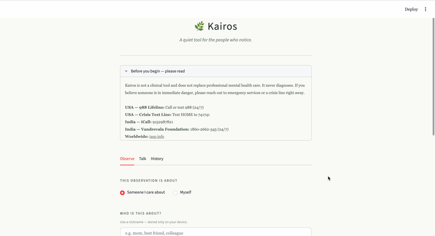

# Kairos

> *From the Greek — "the opportune moment." The right time to reach out, say the right thing, or simply be present.*



Kairos is a private, culturally-aware early warning system that helps people support someone they love who is silently burning out — without that person ever needing to ask for help.

---

## The Problem

Most mental health tools are built for people who have already accepted they have a problem. That's maybe 5% of the people who need help.

The other 95% — people who would never download a mental health app, who carry everything silently, whose warning signs show up in how they behave rather than what they say — have nothing.

Kairos is built for them. And for the people who love them and don't know what to do.

---

## How It Works

Kairos models mental health deterioration as a **cascade** — not isolated conditions but a connected progression:
It has two users:

**The Observer** — a friend, child, partner, or sibling who notices something is wrong but doesn't know how to act without making it worse.

**The Subject** — the person who is struggling. They can optionally engage with Kairos conversationally, but never have to. The system works even if they never touch it.

---

## What Makes Kairos Different

| | Kairos | ChatGPT / Generic LLM |
|---|---|---|
| Trained cascade model | Yes — 240K posts, 0.924 AUC | No |
| Observer vs first-person mode | Yes | No |
| Longitudinal memory | Yes — tracks trajectory over time | No — resets every conversation |
| Fully local, zero data sent out | Yes — runs on your machine | No |
| Relationship-aware guidance | Yes — tailored per relationship type | No |
| Cultural sensitivity | Yes — built for non-Western contexts | Generic |

---

## What Kairos Does

1. **Tracks** — The observer logs simple observations in plain language. NLP maps them to the cascade over time.
2. **Understands** — Builds a longitudinal picture of where the subject is. Not just today, but trajectory over weeks.
3. **Guides** — Tells the observer what to say, when to say it, and what to avoid. Culturally aware, relationship-aware, stage-aware.

---

## Model Performance

Trained on 240,448 Reddit posts across three cascade stages with observer-perspective augmentation.

| Stage | Precision | Recall | F1 |
|---|---|---|---|
| Stress | 0.86 | 0.87 | 0.86 |
| Depression | 0.77 | 0.92 | 0.84 |
| Crisis | 0.78 | 0.61 | 0.68 |
| **Overall** | **0.80** | **0.80** | **0.80** |

**AUC: 0.924**

---

## Tech Stack

| Layer | Tools |
|---|---|
| NLP and Features | VADER Sentiment, NLTK, custom psycholinguistic word lists |
| Classifier | XGBoost, scikit-learn, SHAP |
| LLM Guidance | Mistral 7B via Ollama — fully local |
| API | FastAPI |
| Frontend | Streamlit |
| Privacy | 100% local — no data leaves your device |

---

## Ethical Guardrails

- Never diagnoses — uses signal and pattern language only
- Always redirects to professionals when signals are serious
- Consent-first — subject must know the app exists
- Honest uncertainty — says I don't know when signals are ambiguous
- Crisis protocol — hardcoded escalation with US and India crisis resources

See [ETHICS.md](ETHICS.md) for full detail.

---

## Setup

```bash
git clone https://github.com/jem-thanmay/Kairos.git
cd Kairos

python3 -m venv venv
source venv/bin/activate
pip install -r requirements.txt

# Install Ollama from https://ollama.com then:
ollama pull mistral

# Run
bash run.sh
```

---

## Project Status

- [x] Data pipeline — 240K posts unified across 3 cascade stages
- [x] Feature extraction — 14 psycholinguistic and 2 behavioral features
- [x] Cascade classifier — XGBoost, 80% accuracy, 0.924 AUC
- [x] Observer vs first-person input handling
- [x] Mistral-powered dynamic relationship-aware guidance
- [x] Streamlit frontend
- [ ] Longitudinal tracking across sessions
- [ ] Conversational layer for subject engagement

---

## Disclaimer

Kairos is a research and portfolio project. It is not a clinical tool and does not replace professional mental health care. If you or someone you know is in crisis, please contact a mental health professional or a crisis line.

**USA — 988 Suicide and Crisis Lifeline:** Call or text 988 (24/7)
**India — iCall:** 9152987821

---

*Built by [Thanmay Jembige](https://jem-thanmay.vercel.app)*
